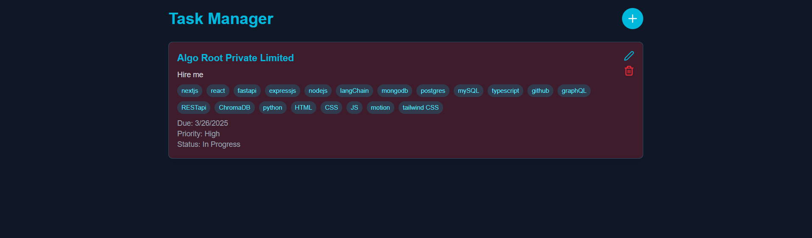

# 🚀 Task Manager: Streamline Your Productivity

## Overview

Welcome to Task Manager - a modern, intuitive task management application designed to help you stay organized and productive. Built with Next.js, TypeScript, and MongoDB, this app transforms how you track and manage your tasks.



## ✨ Features

- **Sleek Dark Mode Design**: A visually appealing and eye-friendly interface
- **Priority Tracking**: Categorize tasks as low, medium, or high priority
- **Flexible Status Management**: Track tasks from "To Do" to "Completed"
- **Tag System**: Organize tasks with custom tags
- **Smooth Animations**: Seamless interactions powered by Framer Motion
- **Responsive Design**: Perfect on desktop and mobile
- **Type-Safe Development**: Built with TypeScript for reliability

## 🛠 Tech Stack

- **Frontend**: Next.js 14
- **Styling**: Tailwind CSS
- **Database**: MongoDB
- **State Management**: React Hooks
- **Animations**: Framer Motion
- **Icons**: Lucide React

## 🚦 Getting Started

### Prerequisites

- Node.js (v18+ recommended)
- MongoDB Atlas or local MongoDB instance
- npm or yarn

### Installation

1. Clone the repository
```bash
git clone https://github.com/your-username/task-manager.git
cd task-manager
```

2. Install dependencies
```bash
npm install
# or
yarn install
```

3. Set up environment variables
Create a `.env.local` file in the root directory:
```
MONGODB_URI=your_mongodb_connection_string
```

4. Run the development server
```bash
npm run dev
# or
yarn dev
```

🎉 Open [http://localhost:3000](http://localhost:3000) and start managing your tasks!

## 🌟 Key Components

- **Task Creation**: Intuitive modal for adding and editing tasks
- **Dynamic Filtering**: Easy task management with priority and status filters
- **Responsive Animations**: Smooth, engaging interactions

## 🔍 How It Works

1. Create a task with title, description, priority, and optional tags
2. Organize tasks by status
3. Edit or delete tasks with simple controls
4. Stay on top of your productivity

## 🤝 Contributing

Contributions are welcome!

1. Fork the repository
2. Create your feature branch (`git checkout -b feature/AmazingFeature`)
3. Commit your changes (`git commit -m 'Add some AmazingFeature'`)
4. Push to the branch (`git push origin feature/AmazingFeature`)
5. Open a Pull Request

## 🛡️ License

Distributed under the MIT License. See `LICENSE` for more information.

## 📞 Contact

Your Name - anish8427singh@gmail.com

Project Link: [https://github.com/ChandelAnish/Task_Manager](https://github.com/ChandelAnish/Task_Manager)

---

Made with ❤️ and lots of ☕ by [Your Name]

**Manage Tasks, Boost Productivity!** 🚀📋